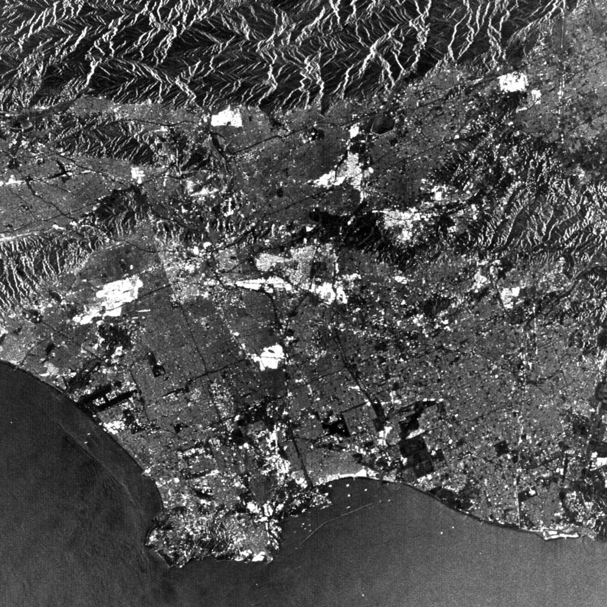
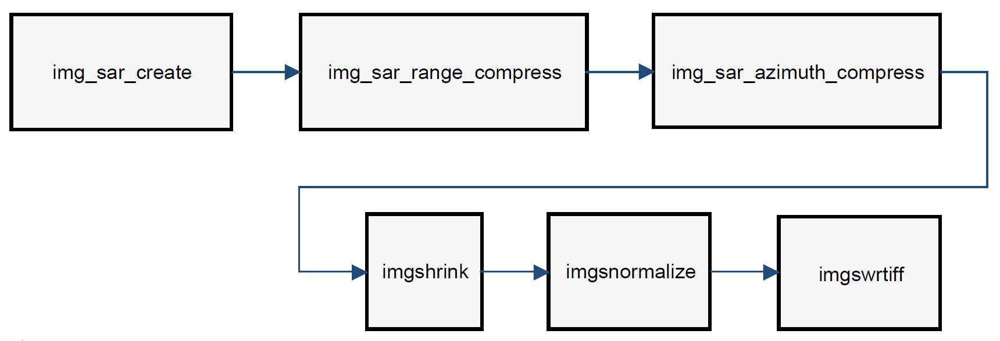

# synthetic-aperture-radar
Modeling and Simulation of Synthetic Aperture Radar (SAR) in Capsim
Block Diagram Modelling and Simulation Tool. 
Papers on SAR Image Formation (LaTex)

<h1 align="center">Synthetic Aperture Radar</h1>

<a href="#capsim_instructions" >Instructions</a> for Running Capsim&reg; SAR Block Diagram Simulation.
  
<table width="964" border="1">
  <tbody>
    <tr>
      <th width="48" scope="col">
Item
</th>
      <th width="409" scope="col">Description</th>
      <th width="144" scope="col">Author</th>
      <th width="112" scope="col">Date</th>
      <th width="217" scope="col">
Download
</th>
    </tr>
    <tr>
      <td>
1
</td>
      <td>Synthetic Aperture Radar Point Target Response</td>
      <td>Sasan Ardalan</td>
      <td>1987-2006</td>
      <td>

</td>
    </tr>
    <tr>
      <td>
2
</td>
      <td>Synthetic Aperture Radar Simplified</td>
      <td>Sasan Ardalan</td>
      <td>1987-2006</td>
      <td>

</td>
    </tr>
 <tr>
      <td>
3
</td>
      <td>Key Paper <strong></strong>Image formation from spaceborne synthetic aperture</strong></td>
      <td>McDonough R.N., et. al.</td>
      <td>1985 APL Technical Digest Vol. 6, No. 4 pp 300-312. </td>
      <td></td>
    </tr>  
  </tbody>
</table>

SEASAT SAR Image Los Angeles (JPL)

   

  

      

<table width="100%" border="1" cellpadding="2" cellspacing="2" style="background-color: #ffffff;">
<tr valign="top">
<td width="45" style="border-width : 0px;">
<b>Item</b>

</td>
<td width="199" style="border-width : 0px;">
<b>Block Name</b>

</td>
<td width="365" style="border-width : 0px;">
<b>Description</b>

</td>
<td style="border-width : 0px;">
<b>Source Code<b>

</td>
<td style="border-width : 0px;"> 
</td>
</tr>
<tr valign="top">
<td width="45" style="border-width : 0px;">
1

</td>
<td width="199" style="border-width : 0px;">
img_sar_create

</td>
<td width="365" style="border-width : 0px;">
Create SAR image from parameters

</td>
<td style="border-width : 0px;">CAPSIM_PATH/BLOCKS/img_sar_create.s 
</td>
<td style="border-width : 0px;"> 
</td>
</tr>
<tr valign="top">
<td width="45" style="border-width : 0px;">
2

</td>
<td width="199" style="border-width : 0px;">
img_sar_range_compress

</td>
<td width="365" style="border-width : 0px;">
Compress SAR image in range

</td>
<td style="border-width : 0px;">CAPSIM_PATH/BLOCKS/img_sar_range_compress.s 
</td>
<td style="border-width : 0px;"> 
</td>
</tr>
<tr valign="top">
<td width="45" style="border-width : 0px;">
3

</td>
<td width="199" style="border-width : 0px;">
img_sar_azimuth_compress

</td>
<td width="365" style="border-width : 0px;">
Azimuth compression SAR Image Formation

</td>
<td style="border-width : 0px;">CAPSIM_PATH/BLOCKS/img_sar_azimuth_compress.s 
</td>
<td style="border-width : 0px;"> 
</td>
</tr>
<tr valign="top">
<td width="45" style="border-width : 0px;">
4

</td>
<td width="199" style="border-width : 0px;">
imgshrink

</td>
<td width="365" style="border-width : 0px;">
This block inputs an image and decimates it.

</td>
<td style="border-width : 0px;">CAPSIM_PATH/BLOCKS/imgshrink.s 
</td>
<td style="border-width : 0px;"> 
</td>
</tr>
<tr valign="top">
<td width="45" style="border-width : 0px;">
5

</td>
<td width="199" style="border-width : 0px;">
imgnormalize

</td>
<td width="365" style="border-width : 0px;">
Input an image and normalize to range 0-255 and output

</td>
<td style="border-width : 0px;">CAPSIM_PATH/BLOCKS/imgnormalize.s 
</td>
<td style="border-width : 0px;"> 
</td>
</tr>
<tr valign="top">
<td width="45" style="border-width : 0px;">
6

</td>
<td width="199" style="border-width : 0px;">
imgwrtiff

</td>
<td width="365" style="border-width : 0px;">
Writes an input image to a TIFF file as 8 bit samples. Also store the current colormap 

</td>
<td style="border-width : 0px;">CAPSIM_PATH/BLOCKS/imgwrtiff.s 
</td>
<td style="border-width : 0px;"> 
</td>
</tr>
</table>

<h1>    Instructions for Running Capsim&reg; SAR Block Diagram Simulation.</h1>
  
Obtain the Capsim&reg; Text Mode Kernel (CapsimTMK) for Linux  from:

<a href="https://github.com/silicondsp/capsim-tmk">GitHub Capsim Text Mode  Repository </a>

CapsimTMK is  distributed with all the blocks that are needed for modeling and simulating Synthetic Aperture Radar.

 This Repository contains the Topologies for SAR. 

Note: Follow the Getting Started Guidelines in the CapsimTMK Repository.

Once CapsimTMK is installed just run 'make' in this directory (in the SAR repository):  SAR_CapsimTMK_Project

Then change to the directory 'Topologies' and run:

<strong></strong>../capsim sar_image_formation_5.t </strong>

The new image files created will be listed in the console.

For the Capsim Block Diagram and List of Blocks click <a href="#capsim">here</a>.
  
    
 
 Raw SAR SEASAT Image for Point Target created by Capsim&reg; SAR Block <strong>img_sar_create.s</strong> 
     
    
 
Capsim&reg; SAR Image Formation  Point Target (SEASAT) 
